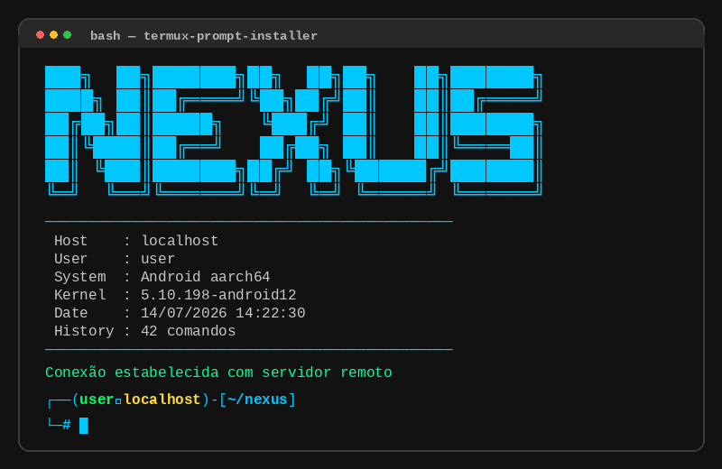

<p align="center">
  
</p>

<h1 align="center">🚀 Termux Prompt Installer</h1>

<p align="center">
  <strong>Instalador automático de prompt personalizado para Termux</strong>
  <br>
  Banner ASCII + informações do sistema + frases hackers + PS1 customizado
</p>

<p align="center">
  
  
  
</p>

---

## 📋 Pré-requisitos

Antes de instalar, execute no Termux:

```bash
# Atualizar os pacotes
pkg update && pkg upgrade -y

# Dar acesso ao armazenamento do Android
termux-setup-storage

# Instalar ferramentas essenciais
pkg install -y git curl wget nano vim unzip zip tar python nodejs openssh
```

---

## 📦 Instalação

```bash
bash -c "$(curl -fsSL https://raw.githubusercontent.com/carlos46743/termux-prompt-installer/main/install.sh)"
```

---

## 🎨 Personalização

Durante a instalação você escolhe:

| Opção | Descrição |
|-------|-----------|
| **Nome do banner** | Texto exibido no banner FIGlet |
| **Cor do banner** | Cor do banner, bordas e destaque |
| **Cor dos textos** | Cor do caminho, seta e informações |

---

## ⚡ Funcionalidades

- **Banner FIGlet** — nome do prompt em ASCII art na abertura do terminal
- **Informações do sistema** — hostname, usuário, kernel, data, histórico
- **Frases hackers** — exibe frases aleatórias do arquivo `~/.frases_hacker`
- **PS1 moderno** — prompt de duas linhas com `┌──(user㉿host)-[path]` e `└─#`
- **Backup automático** — `~/.zshrc` original salvo como `~/.zshrc.bak`
- **MOTD removido** — a mensagem "Welcome to Termux!" não aparece mais

---

## 🧩 Adicionar frases hackers

```bash
echo "root@192.168.0.1:~/ $ # access granted" >> ~/.frases_hacker
echo "Conexão estabelecida com servidor remoto" >> ~/.frases_hacker
echo "Tunnels: 3 ativos | Firewall bypassed" >> ~/.frases_hacker
```

---

## 📁 Estrutura

```
termux-prompt-installer/
├── install.sh
├── LICENSE
├── README.md
└── screenshots/
    └── preview.png
```

---

<p align="center">
  <sub>Feito com ❤️ para a comunidade Termux</sub>
</p>
